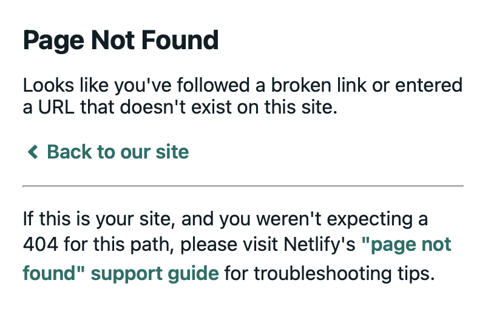

Recently I was reading a post from 2020 on the [RStudio Blog](https://www.rstudio.com/blog/), when I followed a link in the post only to find...



Of course, it was easy to find the intended page with Google, but it made me curious:

* How many HTTP 404 (Page Not Found) errors like this exist in the RStudio Blog?

* Which links are broken?

* Could these broken links be easily fixed?

It turns out we can get at these questions pretty quickly with R.  Especially, if we break the overall mini-project into even smaller tasks such as:

* Get all of the blog posts on the RStudio Blog

* Get all of the links out of each blog post

* Test out all of the links

# Getting All Blog Posts

Clicking around in [the blog](https://www.rstudio.com/blog/) reveals 38 pages of blog posts ranging from early 2011 to recently in December 2021 (Happy belated 10th birthday RStudio blog!).

Let's see if we can harvest or "rvest" all of the links.

First, let's build the 38 urls we need to retrieve links from.

```{r}
n_pages <- 38
url_bloghome <- 'https://www.rstudio.com/blog' # This is page 1
url_blogpages <- c()
for (i in 1:38){
  current_url <- url_bloghome
  if (i > 1){
    current_url <- file.path(url_bloghome, 'page', i)
  }
  url_blogpages <- c(url_blogpages, current_url)
}
str(url_blogpages)
head(url_blogpages)
```

Now, let's pull all of the blog post links out of these 38 urls.

```{r}
library(rvest)
get_blogposts <- function(url){
  read_html(url) %>%
    html_nodes('.pt-3') %>%
    html_nodes('a') %>%
    html_attr('href')
}
blogposts <- unname(unlist(sapply(url_blogpages, FUN=get_blogposts)))
str(blogposts)
head(blogposts, 25)
```

Check that out, we have 562 blog post urls now!

# Get Links from the Blog Posts

Let's pull all of the links from all of those blog posts.

```{r}
extract_links <- function(blogpost){
  read_html(blogpost) %>%
    html_nodes('a') %>%
    html_attr('href') %>%
    unique() %>%
    sort()
}
links <- sapply(blogposts, extract_links)
```

# Clean the Links

Now let's get a unique list of links so we can check for the 404 errors.

```{r}
unique_links <- sort(unique(unname(unlist(links))))
str(unique_links)
head(unique_links, 10)
tail(unique_links, 10)
```

It looks like we have both absolute and relative urls, so let's clean this up a bit.
To keep things simple for this analysis, we'll assume:

* All absolute links start with `http`
* All absolute links start with `/`
* We will ignore all other links (such as `mailto:...`)

```{r}
absolute_links <- unique_links[substring(unique_links, 1, 4) == 'http']
relative_links <- unique_links[substring(unique_links, 1, 1) == '/']
clean_links <- c(paste0('https://www.rstudio.com', relative_links), absolute_links)
str(clean_links)
head(clean_links)
tail(clean_links)
```

It looks like we've dropped less than 150 links.  That seems reasonable.

Let's limit our scope even further to only links to RStudio.com web pages.  Why?
Two motivating reasons:

* These are likely easily fixed by RStudio or the R community.  Whereas, if companyabc.com existed
about five years ago and no longer existed, there is not really much to do about it.

* This is meant to be a fun mini project & not an all encompassing exercise (More generally,
without scope limits, things intended to take hours can easily take days.)

```{r}
clean_rstudio_links <- clean_links[grepl('rstudio.com', clean_links, fixed=TRUE)]
str(clean_rstudio_links)
```

This still leaves us with over 1500 links to check :-) even with our limited scope.  Let's
see if we can quick categorize these links a bit.  Perhaps by whatever comes right
before rstudio.com.

```{r}
get_prefix <- function(link, term='rstudio'){
  dotsplit <- unlist(strsplit(link, '\\.'))
  rsindex <- grep(term, dotsplit)
  dotsplit[rsindex - 1]
}
clean_rstudio_links2 <- unlist(sapply(clean_rstudio_links, get_prefix))
table(clean_rstudio_links2)
```

Finally, let's remove a few of these that will break my checking function below (or would require me to add error handling).  Specifically, the 2 links that `https://doc.rstudio.com/` with are non-starters as those take my to a "Can't Find the Server" error.  So, yes, those are broken links, but not 404 errors, and we are going to manually remove them for this analysis.

```{r}
clean_rstudio_links3 <- clean_rstudio_links[!grepl('doc.rstudio.com', clean_rstudio_links, fixed=TRUE)]
str(clean_rstudio_links3)
```

# Check the Links

```{r}
library(httr)
link_status <- unlist(sapply(clean_rstudio_links3, function(x)
  unname(GET(x)['status_code'])))
str(link_status)
```

How many HTTP 404 errors did we find?  117

```{r}
links404 <- names(link_status[link_status == 404])
str(links404)
head(links404)
tail(links404)
```

# Sanity Check

Let's do a quick manual check here on at least one of these broken links.  How about
the first one?  [(https://www.rstudio.com/2014/06/18/r-markdown-v2/)](https://www.rstudio.com/2014/06/18/r-markdown-v2/).

To truly sanity check this, we would want to find the original blog post containing
the link and try clicking the link in the post.

So which blog post contained this link?

```{r}
result <- sapply(links, function(x) '/2014/06/18/r-markdown-v2/' %in% x)
result[result]
```

And indeed if we navigate to [https://www.rstudio.com/blog/introducing-ggvis/](https://www.rstudio.com/blog/introducing-ggvis/) and try clicking on the [R Markdown v2](https://www.rstudio.com/2014/06/18/r-markdown-v2/) link in the blog post, we are taken to the Page Not Found error page.

# Concluding Remarks

To conclude, let's circle back to our original questions.

* How many HTTP 404 (Page Not Found) errors like this exist in the RStudio Blog?

We ended limiting scope to only rstudio.com links and found that 117 of over 1500 unique
links are currently returning a 404 error.  Furthermore, there are two links to doc.rstudio.com that return a `Can't Find the Server` error.

* Which links are broken?

A full list of the broken links is printed in the appendix (sorted alphabetically).

* Could these broken links be easily fixed?

The RStudio blog does not appear to be open source, thus we cannot create a PR to
fix the links.  However, the most notable thing is that many of the broken links seem to
follow certain patterns, notably related to absence or presence of dates that could hopefully be easily fixed.  Consider these two examples.

EXAMPLE 1

This [blog post](https://www.rstudio.com/blog/role-of-the-data-scientist/), after redirects,
is linked to [https://www.rstudio.com/blog/driving-real-lasting-value-with-serious-data-science/](https://www.rstudio.com/blog/driving-real-lasting-value-with-serious-data-science/
) but the correct link should have a yyyy-mm-dd in the slug: [https://www.rstudio.com/blog/2020-05-19-driving-real-lasting-value-with-serious-data-science/](https://www.rstudio.com/blog/2020-05-19-driving-real-lasting-value-with-serious-data-science/)

EXAMPLE 2

This [other blog post](https://www.rstudio.com/blog/introducing-ggvis/)
is linked to [https://www.rstudio.com/2014/06/18/r-markdown-v2/](https://www.rstudio.com/2014/06/18/r-markdown-v2/) and in this case the `/yyyy/mm/dd/` folders need to be replaced with simply `/blog/`.  The correct link should be [https://www.rstudio.com/blog/r-markdown-v2/](https://www.rstudio.com/blog/r-markdown-v2/).

In other words, afik these links cannot be fixed by the community (i.e. me via a PR), but someone with access could presumably fix this up with a little effort.  Also, at this point, we'd likely want someone with domain knowledge of the RStudio Blog who could combine these results with their knowledge to determine a next steps.

Thank you for reading, I hope you have enjoyed this analysis!

# Appendix

Here is the full vector of 404 error links.

```{r}
links404
```
